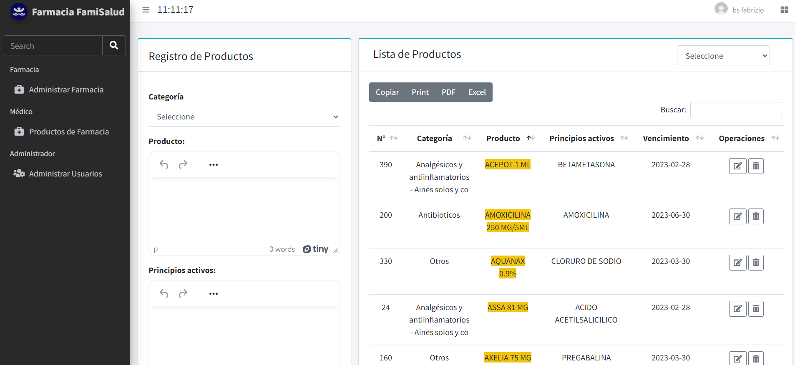
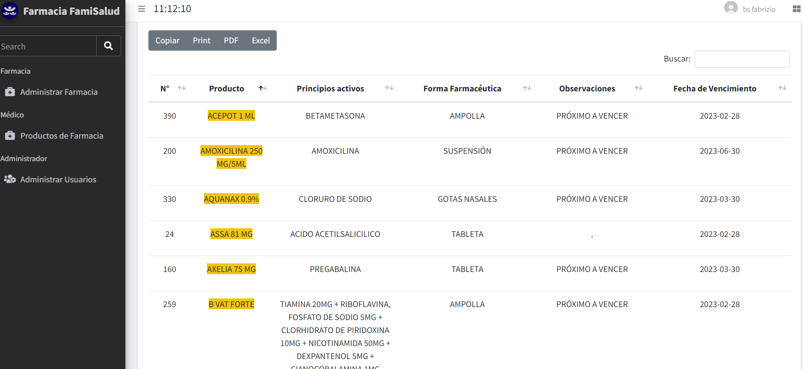
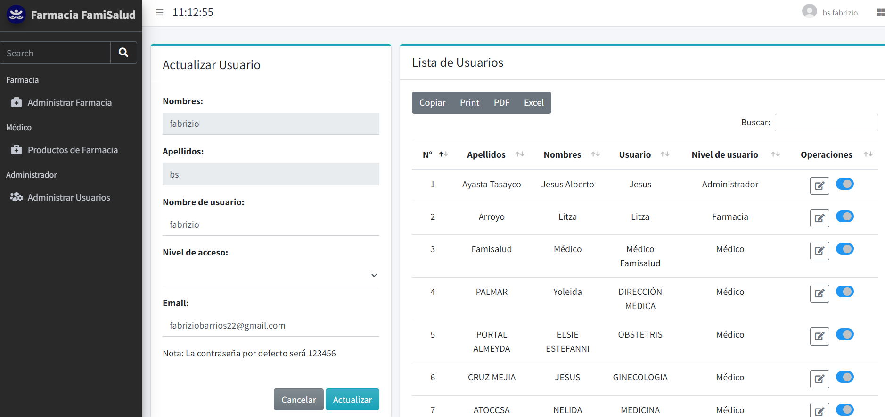
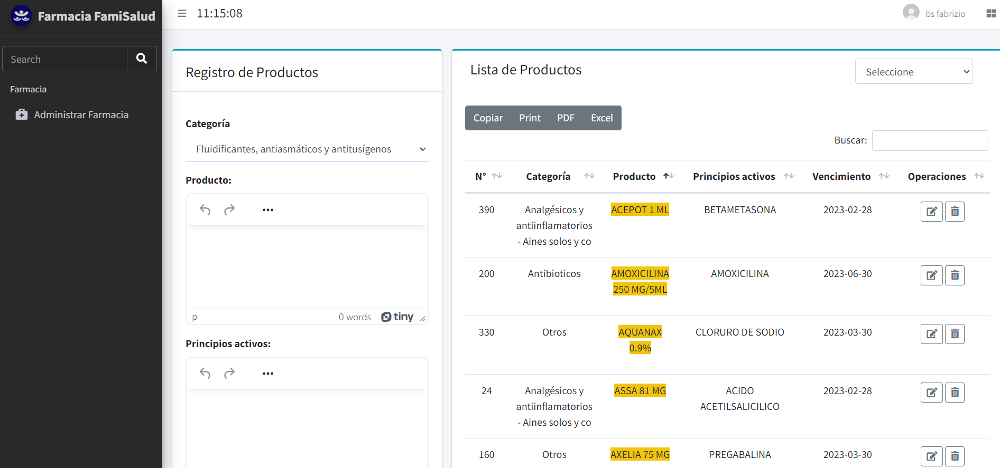
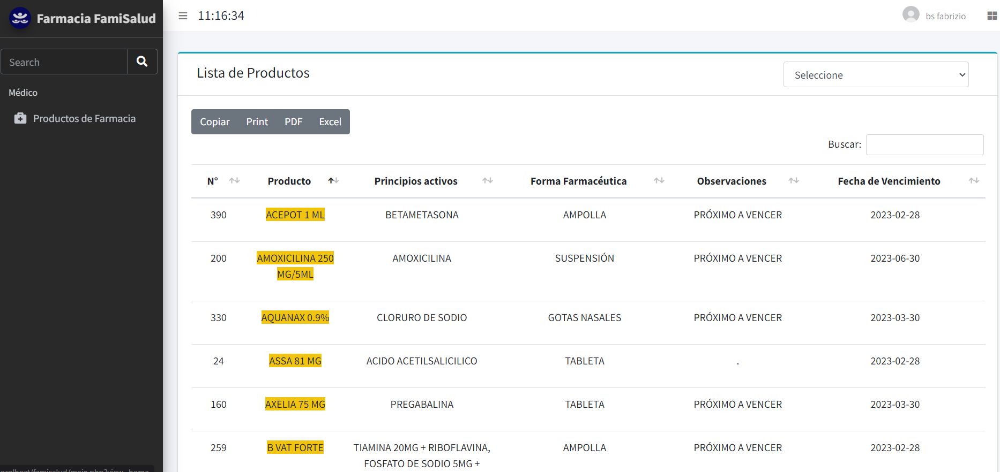

<h4>APLICATIVO WEB DE CLINICA Y FARMACIA FAMISALUD</h4>
<h4>Lenguajes Utilizados:</h4>

<h4 class="py-3">PHP</h4>
<h4 class="py-3">CSS</h4>
<h4 class="py-3">HTML</h4>
<h4 class="py-3">JAVASCRIPT</h4>
<h4 class="py-3">BOOTSTRAP</h4>
<h4 class="py-3">FONT AWESOME</h4>
<h4 class="py-3">FIGMA</h4>
<h4 class="py-3">ADOBE XD</h4>
<h4 class="py-3">ERWIN</h4>
<h4 class="py-3">DATATABLES</h4>
<h4 class="py-3">PHPMAILER</h4>
<h4 class="py-3">SweetAlert2</h4>
  
<h4 class="py-3">POR EL MOMENTO SE ENCUENTRA EN MANTENIMIENTO</h4>
<i>SE ESTAN CORRIGIENDO ALGUNOS ERRORES Y AGREGANDO MAS ARCHIVOS</i>
<h4>VISTA DE ADMINISTRADOR</h4>

<h4>VISTA DE FARMACIA</h4>

<h4>VISTA DE MEDICO</h4>

<h1>Pronto Nueva App de Escritorio</h1>
<h3><b>Realizado por:</b> Fabrizio Barrios Saavedra (RFBS19)</h3>

